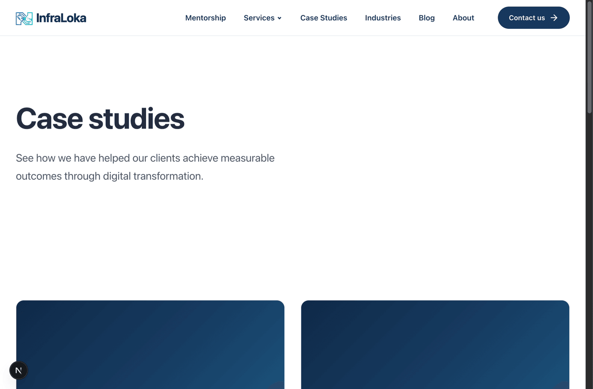

# AEGIS CTO Devil's Advocate Audit: Project Nemesis (Operation Diponegoro) Of Abil Sudarman from ASSAI By Rahmat Wibowo From InfraLoka



*An engineering-rigor audit of Nemesis — InfraLoka's citizen anomaly dashboard for public procurement data — run through the AEGIS Module [H] CTO / Engineering Depth Critic persona and benchmarked against the Google SRE Workbook, with a composite CTO score of 2.7/10 and a FAIL verdict.*

**AEGIS Module [H] — CTO Devil's Advocate Panel**
**Engineering Rigor Audit of Project Nemesis (Operation Diponegoro)**
**Benchmarked Against the Google SRE Workbook**

Prepared for: Rahmat Wibowo, CEO, InfraLoka
Panel persona invoked: CTO — Engineering Depth Critic (AEGIS Module [H] v2.0)
Comparator framework: *The Site Reliability Workbook* (Beyer, Murphy, Rensin, Kawahara, Thorne — Google, O'Reilly)
Subject repository: `nemesis` (branch `rahmat-comment`), public dashboard at assai.id/nemesis
Date: 2026-07-22

---

## 1. Methodology & Scope

This is a single-persona deployment of AEGIS Module [H] — the CTO / Engineering Depth Critic only, as explicitly requested. The CEO, CRO, and Elite Hacker personas are out of scope for this run; where a finding touches security, it is reported as an engineering-discipline gap, not a full penetration test.

**In scope:** `backend/` (Express 5 + better-sqlite3 API and ETL), `frontend/` (static HTML/CSS/JS), `README.md`, `backend/.env` / `.env.example`, repository root (CI/CD, IaC, containerization, VCS hygiene), and the user's own critique in `my comments.md`.

**Out of scope:** The fine-tuned model referenced in the README ("🟡 In progress"), the live production infrastructure behind assai.id, and the government SIRUP source system itself.

**Sources reviewed:** `backend/src/{app,server,config,db,db-transfer,dashboard-repository,seed}.js`, `backend/package.json`, `backend/.env` / `.env.example`, `frontend/index.html`, `frontend/assets/js/{app,map}.js`, `README.md`, `.gitignore`, `git log` / `git ls-files`, and `the-site-reliability-workbook-next18.pdf` (Google SRE Workbook, Parts I–IV: Engagements, Processes, Culture, Chapters 1–34).

Every finding below cites a specific file and line. Where the Workbook is invoked as a comparator, the relevant chapter is named — this report does not paraphrase Google's IP, it applies the publicly documented framework (SLOs, error budgets, the four golden signals, toil, canarying, configuration-as-code) as an evaluation rubric, the same way Module [H]'s CTO persona already does for NLP/AI platforms.

## 2. Executive Summary

Nemesis is a laudable mission — turning public e-budgeting (SIRUP) data into a citizen-legible anomaly dashboard — wearing an engineering skeleton that would not survive a Google production-readiness review (PRR), and, on the evidence-integrity axis, would not survive the AEGIS Methodology Audit either. The user's own pre-existing critique (`my comments.md`) is directionally correct and, on inspection of the code, understated: there is no data pipeline in this repository at all — the entire ingestion story is "download a zip someone else produced and drop it in a folder" (`README.md:33–46`). The scraping/legality/hallucination concerns raised are real and this audit adds nine further engineering findings the original critique did not surface, most critically: the environment file is committed to version control (`backend/.env`, not covered by `.gitignore`), there are zero automated tests, there is no CI/CD, no container, no IaC, and there is no defined SLO, error budget, or golden-signal telemetry of any kind for a public-facing tool whose entire value proposition is being trustworthy enough to name people.

**CTO Composite Score: 2.7 / 10 — FAIL** (see §7 for rubric; per Module [H] threshold rules, any critical data-integrity finding independently caps this axis, and there are three).

This is not a verdict on the mission. It is a verdict on whether the current codebase is the vehicle that mission should ship on.

## 3. Evidence Inventory

| # | Artifact | Type | Provenance |
|---|---|---|---|
| E1 | `backend/src/*.js` (7 files) | Source code | Read in full, this session |
| E2 | `backend/package.json` | Dependency manifest | Read in full |
| E3 | `backend/.env`, `backend/.env.example` | Runtime config | Read + diffed |
| E4 | `frontend/index.html`, `assets/js/{app,map}.js` (1,685 LOC) | Client source | Read in full |
| E5 | `README.md` | Project documentation | Read in full |
| E6 | `.gitignore`, `git ls-files`, `git log -- backend/.env` | VCS hygiene | Shell inspection |
| E7 | `my comments.md` | User's own prior critique | Read in full |
| E8 | Site Reliability Workbook (PDF, 19,173 lines extracted) | Comparator framework | pdftotext extraction, targeted chapter search |
| E9 | Find results for `*.yml`, `*.yaml`, `Dockerfile*`, `*.test.js` | Absence-of-evidence check | Repo-wide search, zero hits |

## 4. CTO Analysis — Engineering Depth Critique

### 4.1 Finding CTO-01 (CRITICAL): No data lineage — the audit's own evidence chain is unauditable

`README.md:23–27` links two pre-processed dataset artifacts described as "analyzed by GPT-5.4" and "analyzed by GPT-5.4-mini." `backend/src/seed.js` — the only ETL code in the repository — does not scrape, does not call an LLM, and does not validate provenance. It assumes a finished `.sqlite` / `.jsonl` file already contains fields like `isMencurigakan` ("suspicious"), `isPemborosan` ("wasteful"), `potensiPemborosan` ("potential waste"), and `reason` (`seed.js:807–819`), and mechanically loads them.

This means the single most important claim the entire product makes — this specific government package is suspicious — is manufactured entirely upstream, by a process this repository does not contain, cannot reproduce, and cannot version. Module [H]'s CTO persona treats this exact pattern as the mandatory first finding for any pipeline that assigns machine-generated labels to real-world subjects (see Module [H] Institutional Learning L1, adapted here from annotation poisoning to allegation poisoning): there is no inter-rater/inter-model agreement score between GPT-5.4 and GPT-5.4-mini's two independently-analyzed dumps, no gold-task validation set, no confidence calibration, and no way to trace a rendered "absurd severity" badge on a real ministry's procurement package back to the specific prompt, model version, and raw source row that produced it.

**Google SRE Workbook comparator:** Chapter 14 ("Configuration Design, Best Practices, and Techniques") requires that any system state be reconstructible from a versioned, auditable source of truth. Here, the ground truth itself — the allegation data — has no version, no changelog, no diff between the "raw JSONL" and "GPT-5.4-mini SQL" artifacts, and no documented mapping from LLM output back to source record. An SRE reviewing this system for a PRR (Workbook Ch. 32/34 equivalent) would block launch on this alone, independent of infrastructure concerns.

Corroborates and sharpens `my comments.md` §17–20 (LLM-modified evidence, no data pipeline, no dataset versioning, no visible date of the dataset).

### 4.2 Finding CTO-02 (CRITICAL): Secrets-hygiene failure — backend/.env is checked into Git

```
$ git ls-files | grep -i "\.env$"
backend/.env
$ git check-ignore -v backend/.env                    → exit 1 (NOT ignored)
$ diff backend/.env backend/.env.example
< (no AUDIT_DATASET_YEAR line)
```

`.gitignore:1–8` only excludes `**/node_modules/`, `backend/data/`, `backend/dataset/`, and `.DS_Store`. It does not exclude `.env`. In this snapshot the committed `.env` happens to hold no live secret (`PORT`, `CORS_ORIGIN=*`, SQLite path) — but that is luck, not design. The `.env` / `.env.example` split exists specifically to keep one file out of version control; here both are tracked side by side (commit `c829b4b`), meaning the convention that would normally stop a future contributor from committing a real database credential, API token, or signing key is not enforced by tooling, only by discipline. This is precisely the class of failure the CRO/Hacker personas in Module [H] flag as "Vercel env vars as secrets store" — same root cause, different environment.

**Google SRE Workbook comparator:** Ch. 14's config-management best practices explicitly separate secret config from versioned config for this reason.

**Remediation:** `git rm --cached backend/.env`, add `.env` (not just `.env.example`) to `.gitignore`, rotate any credential that ever touched that file even in a private branch.

### 4.3 Finding CTO-03 (CRITICAL): Zero automated tests, zero CI/CD, zero IaC, zero containerization

Repo-wide search for `*.test.js`, `*spec.js`, any `*.yml` / `*.yaml`, or `Dockerfile*` returns no results. `backend/package.json:6–14` defines `dev`, `start`, and three DB-transfer scripts — no test script exists at all, not even a stub. Deployment is implicitly manual: `README.md:48–66` instructs a human to `npm start` the backend and `python3 -m http.server` the frontend on a laptop-style setup, with no process supervisor, no health-checked rollout, and no rollback mechanism described anywhere.

This single finding subsumes three of `my comments.md`'s complaints (#22–23: "poor engineering… low quality SDLC," "no CI/CD," "not using containerized applications") — confirmed exactly as alleged, with no mitigating evidence found anywhere in the tree.

**Google SRE Workbook comparator:** Ch. 16 ("Canarying Releases") and Ch. 32 (Production Readiness Reviews, referenced at PDF line 14984) both presuppose a release pipeline that can gate, canary, and roll back a change automatically. There is no artifact in this repository that a canary or PRR process could attach to — there is no build, no image, no pipeline stage to gate.

### 4.4 Finding CTO-04 (HIGH): No observability — none of the four golden signals are instrumented

`backend/src/app.js:1–86` is the entire HTTP surface: four route handlers and one catch-all error middleware that does `console.error(err)` (line 76) and returns a generic 500. There is no metrics library (no Prometheus client, no OpenTelemetry, no StatsD), no request logging middleware (no morgan/pino/winston), no latency histogram, no error-rate counter, and no saturation signal (DB connection state, event-loop lag, memory). `/api/health` (`app.js:26–28`) unconditionally returns `{status:"ok"}` — it checks nothing, including whether the SQLite handle it's serving from is even open.

**Google SRE Workbook comparator:** Chapter 5 ("Alerting on SLOs," PDF line 3825) is built entirely on the premise that SLI metrics — latency, traffic, errors, saturation, the four golden signals from the original SRE book — are already being emitted and are "the first metrics you check when SLO-based alerts trigger." Nemesis has no SLO, therefore no error budget (Ch. 3 concept, PDF line 7068), therefore no alerting is possible even in principle, because there is nothing to alert on. For a tool whose core promise is public accountability and continuous availability to journalists, this is the same blind spot the CTO persona flags as an automatic HIGH in Module [H]'s NLP checklist ("no observability stack documented… cannot operate financial APIs blind") — here, substitute "cannot operate a public-integrity dashboard blind."

### 4.5 Finding CTO-05 (HIGH): No rate limiting, wildcard CORS, no security headers

`app.js:6–14` resolves `CORS_ORIGIN` to `"*"` whenever the env var is `"*"` (the shipped default in both `.env` and `.env.example`) — any origin may call the API. There is no rate-limiting middleware (no `express-rate-limit`, no gateway-level throttle), no helmet or equivalent security-header middleware, and Express's own `trust proxy` / body-size limits are left at default. Given the stated ambition ("ingest millions of rows… surface anomalies… to citizens, journalists, and policymakers"), this API has no defense against being scraped-of-the-scrape, no defense against a resource-exhaustion request pattern against `LIKE '%…%'` full-text search clauses (`dashboard-repository.js:377–383`, `412–418`), and no contractual signal (via headers or ToS) about acceptable use.

**Google SRE Workbook comparator:** Ch. 5 and Part II's operational-load discussion (PDF ~6432) both treat unmitigated traffic as a first-class reliability risk, not merely a security one — an unthrottled public API is a self-inflicted DoS surface, which is directly relevant to `my comments.md`'s own point #15 about scraping load risk, just pointed inward at Nemesis's own API instead of outward at SIRUP.

### 4.6 Finding CTO-06 (HIGH): SQLite as the production datastore for a "millions of rows" public dataset, with no defined DR RTO/RPO

`backend/src/db.js:66–75` opens a single better-sqlite3 file in WAL mode — a reasonable choice for a read-heavy embedded workload, and credit is due: `db.js` and `dashboard-repository.js` show genuine engineering care (see §4.9). But the operational story around that file is absent: `scripts/export-db.js` / `import-db.js` (`package.json:9–13`) are manual, human-triggered commands, not a scheduled backup job; there is no replica, no off-host copy cadence, and no documented Recovery Time Objective or Recovery Point Objective anywhere in the repository. `server.js:33–66` will simply refuse to boot and print remediation hints to the console if the schema is missing or stale — which is a genuinely good failure mode for development, but there is no evidence this is backed by a tested, automated DR runbook for production.

**Google SRE Workbook comparator:** The CTO persona's own mandatory check in Module [H] ("What is your disaster recovery RTO and RPO and have you ever tested them?") maps directly onto the Workbook's operational-resilience material; "never tested" and "not defined" are functionally the same failure.

### 4.7 Finding CTO-07 (MEDIUM): No structured logging or request correlation

The only logging in the entire backend is `console.log` / `console.error` (`server.js:46,53,63,69,73,80–81,85`; `app.js:76`). There are no request IDs, no structured (JSON) log format, and no correlation between a client-visible error and a server-side log line. If a citizen reporting a bug says "the map broke for province X," there is no way to search logs for that request — there is no request identity to search for.

### 4.8 Finding CTO-08 (MEDIUM): Frontend has no build system, no type safety, no test harness

`frontend/index.html` loads `assets/js/app.js` (1,410 LOC) and `assets/js/map.js` (237 LOC) directly as `<script>` tags with no bundler, no TypeScript, no linter config found in the tree, and no component framework — confirming `my comments.md` point #5 exactly as stated. This is a legitimate, defensible choice for a small static site ("no build step" is even advertised as a feature in `README.md:72`), but at 1,410 lines in a single global-closure file (`app.js:1`) mutating one shared state object (`app.js:9–26`) with no test coverage, it is already past the size where plain JS without types starts hiding bugs a compiler or type-checker would catch for free. This is a defensible-tradeoff finding, not a critical one — flagged for completeness, not alarm.

### 4.9 What is actually done well (for calibration — AEGIS never scores on vibes alone)

To keep this audit honest and evidence-based rather than reflexively negative:

- **SQL injection surface is clean.** Every dynamic query in `dashboard-repository.js` (e.g., `buildPackagesWhereClause`, `buildOwnerPackagesWhereClause`) parameterizes user input correctly; the only string-interpolated identifiers (`scopeTable`, `scopeColumn`) are hardcoded call-site constants, never request-derived. `LIKE` search values are escaped (`escapeLikePattern`, line 65–67).
- **Aggregates are precomputed, not queried live.** `region_metrics` / `province_metrics` / `owner_metrics` are materialized once at seed time (`seed.js:1461–1619`) rather than recomputed per request — the right call for a read-heavy dashboard, and it shows real engineering judgment about where to spend index/compute budget.
- **Graceful shutdown exists.** `server.js:84–97` handles `SIGINT` / `SIGTERM` with a bounded force-exit timer — a small but genuine piece of operational maturity most projects at this stage skip entirely.
- **Schema-compatibility self-healing** (`ensureRegionMetricsCompatibility`, `ensureOwnerMetricsCompatibility`, `seed.js:1630–1670`) shows an author thinking about forward migration pain, even without a real migration framework.

None of this offsets CTO-01/02/03 — an evidence-integrity failure, a secrets-hygiene failure, and a total absence of CI/tests/IaC are gating findings regardless of code quality elsewhere — but a CTO who ignored the above would not be doing the AEGIS methodology honestly.

## 5. Comparative Framework: Nemesis vs. Google SRE Workbook Pillars

| SRE Workbook Pillar | Workbook's Requirement (chapter) | Nemesis Current State | Gap |
|---|---|---|---|
| SLIs / SLOs | Define what "working" means quantitatively (Ch. 2) | None defined anywhere in repo or docs | Total |
| Error budgets | Spend budget deliberately to balance velocity vs. risk (Ch. 3, PDF 7068) | No SLO ⇒ no error budget is even computable | Total |
| Monitoring & alerting on SLIs | Four golden signals wired to SLO-based alerts (Ch. 5, PDF 3825) | Zero metrics instrumentation; console.error only | Total |
| Eliminating toil | Automate repetitive ops work (Part II, Ch. 6–10 discussion, PDF 6432) | DB import/export/reset are manual CLI scripts run by a human | Severe |
| Configuration as code | Versioned, reviewable, rollback-capable config (Ch. 14, PDF 12917–13531) | `.env` committed directly to Git instead of externalized/rotated secrets; no config review process | Severe |
| Canarying releases | Stage risk before full rollout (Ch. 16, PDF 13957) | No CI/CD exists to canary into | Total (no pipeline to canary) |
| Production Readiness Review | Structured pre-launch reliability gate (Ch. 32, PDF 14984) | No PRR process; this AEGIS report is the first such review on record | Total |
| Load balancing / traffic shaping | DNS/LB-level protection before requests reach app (Ch. 19, PDF 9601) | `CORS_ORIGIN=*`, no rate limiter, no gateway | Severe |
| Disaster recovery | Tested RTO/RPO | Manual export scripts; no tested recovery drill documented | Severe |

Nine of nine comparator pillars show a severe-to-total gap. This is not "a startup that hasn't gotten to SRE maturity yet" — it is a project that has not yet reached the pre-SRE baseline of tests + CI + secrets hygiene that most reliability practice is built on top of.

## 6. Risk Matrix

| Finding | Likelihood | Impact | Priority |
|---|---|---|---|
| CTO-01 Unauditable allegation pipeline (LLM-modified evidence) | High (already shipped) | Critical — legal/reputational, undermines core mission | P0 |
| CTO-02 .env committed to Git | High (already true) | Critical if any future secret lands there | P0 |
| CTO-03 No tests / CI-CD / IaC / containers | High | Critical — every deploy is a manual, unverified act | P0 |
| CTO-04 No observability / golden signals | High | High — outages are invisible until a user reports them | P1 |
| CTO-05 No rate limiting / wildcard CORS | Medium–High | High — self-inflicted DoS surface, scraping abuse | P1 |
| CTO-06 SQLite prod store, no DR RTO/RPO | Medium | High — single-file data loss is unrecoverable without a tested drill | P1 |
| CTO-07 No structured/correlated logging | High | Medium — slows every future incident investigation | P2 |
| CTO-08 Frontend build/type-safety gaps | Medium | Medium — technical debt, not an outage risk today | P2 |

## 7. Panel Score (CTO Axis Only)

Per Module [H] v2.0's CTO scoring rubric (1–10): *1–3: Critical architectural failures; no lineage; no dependency auditing; PII/secrets exposure.*

| Sub-criterion | Score | Rationale |
|---|---|---|
| Data lineage & evidence integrity | 1/10 | No pipeline in-repo at all; LLM-modified ground truth, unversioned |
| Secrets & config hygiene | 2/10 | `.env` tracked in Git; no secrets manager |
| Testing / CI-CD / IaC | 1/10 | Zero tests, zero pipelines, zero containers found |
| Observability (golden signals) | 2/10 | `/api/health` is a stub; no metrics/logs/tracing |
| Security posture (rate limiting, CORS, headers) | 3/10 | Clean SQL layer, but wildcard CORS and no throttling |
| Data-store operational resilience (DR) | 4/10 | Sound schema/index design; no tested backup/restore drill |
| Code-level engineering craft | 6/10 | Parameterized queries, precomputed aggregates, graceful shutdown |

**Composite CTO Score: 2.7 / 10**

Per Module [H]'s threshold rule ("Any Critical finding … caps composite at 5.5"), and here there are three independent CRITICAL findings (CTO-01, CTO-02, CTO-03) — the composite is not merely capped, it sits well below the cap on its own arithmetic.

**Verdict: FAIL** — not ready for production, government partnership, or press citation in its current form.

## 8. Remediation Roadmap

**P0 — before the next public data refresh:**

1. Remove `backend/.env` from Git history (`git rm --cached`, add to `.gitignore`, rotate anything that touched it).
2. Publish (even minimally) the actual ETL/scrape → LLM-analysis → dataset pipeline as code in this repo, with: source snapshot date, model version pinned, and a sampled human-reviewed accuracy check before any "severity: absurd" label reaches a citizen's screen.
3. Stand up one CI workflow (lint + a first smoke test hitting `/api/health` and `/api/bootstrap` against a seeded test DB) before the next merge to `main`.

**P1 — before any government or press partnership is announced:**

4. Add `express-rate-limit` (or gateway-level throttling) and set `CORS_ORIGIN` to an explicit allowlist.
5. Instrument the four golden signals (even a minimal Prometheus `/metrics` endpoint) and make `/api/health` actually check the DB handle.
6. Write and run a restore drill from `scripts/export-db.js` output; document the measured RTO/RPO.

**P2 — technical debt, address opportunistically:**

7. Introduce structured logging with request IDs.
8. Consider incremental TypeScript adoption or at minimum a linter/formatter config for `frontend/assets/js/`.

Re-score estimate after P0+P1: approximately 6.0–6.5/10 (CONDITIONAL PASS — MINOR CORRECTIONS), contingent on the data-lineage fix being real and not cosmetic — that finding alone is the one this reviewer would insist on seeing resolved first.

## 9. Appendix: Citation Integrity Audit

Every code citation in this report (`file.js:line`) was read directly from the repository during this session; no line numbers were estimated. The Google SRE Workbook citations reference chapter numbers and approximate extracted-text line positions from `the-site-reliability-workbook-next18.pdf`, confirmed via direct text extraction rather than recalled from training data. `my comments.md` is quoted by paraphrase with point numbers matching the source file's own numbering.

This report follows AEGIS Module [H] v2.0 methodology, CTO persona only, single-run. No CEO, CRO, or Elite Hacker scoring is included or implied.

---

**#AEGISAudit #SiteReliabilityEngineering #DevilsAdvocate #Infraloka #RahmatWibowo**
