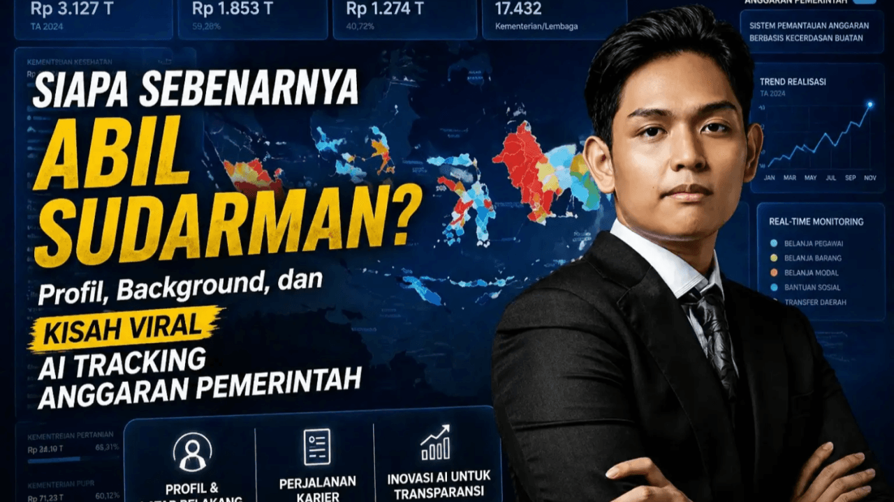
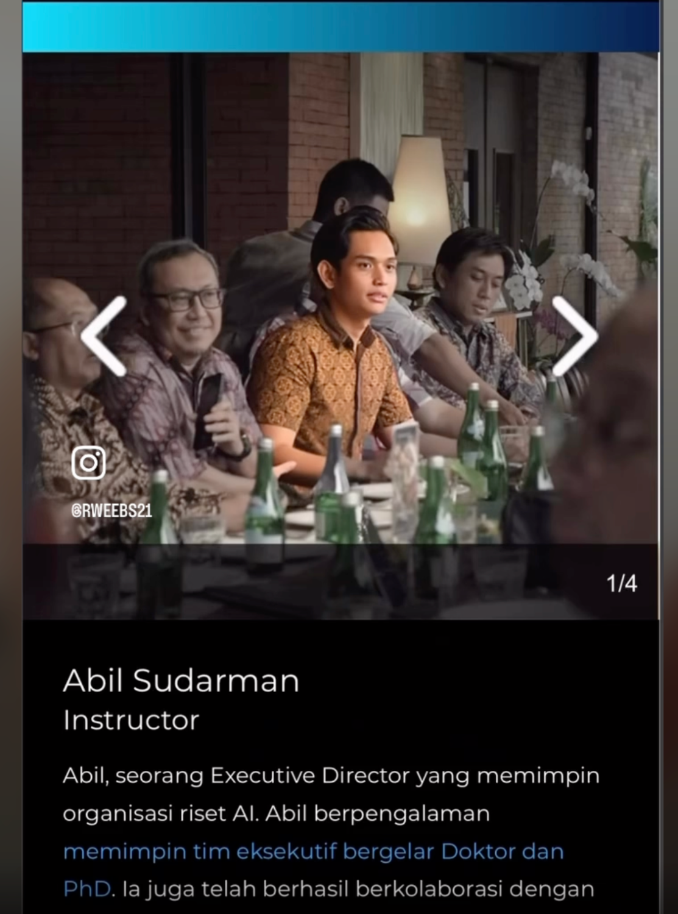
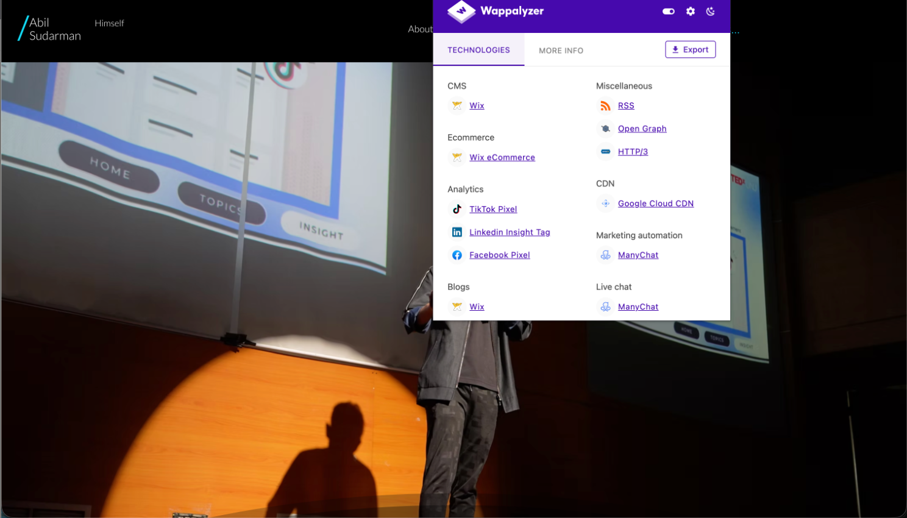
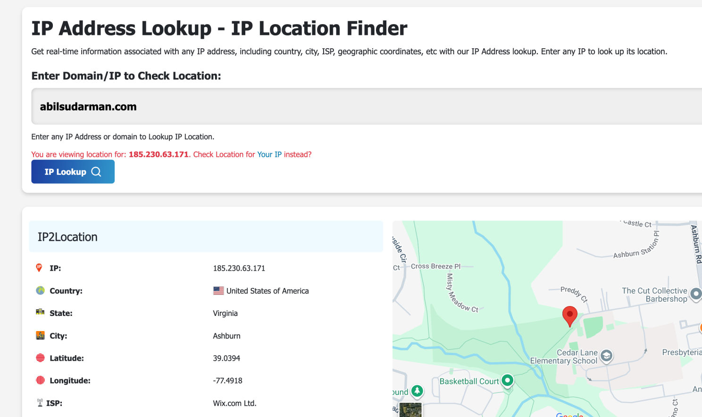
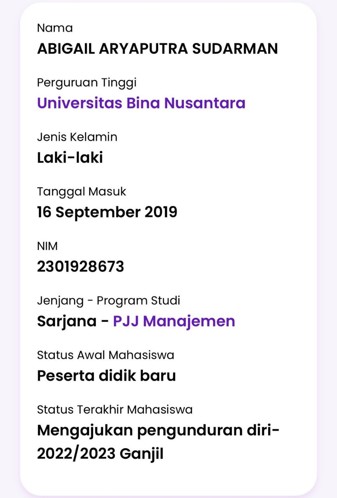
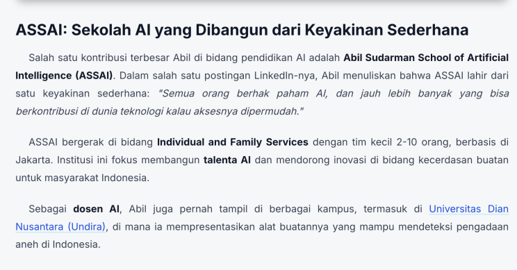
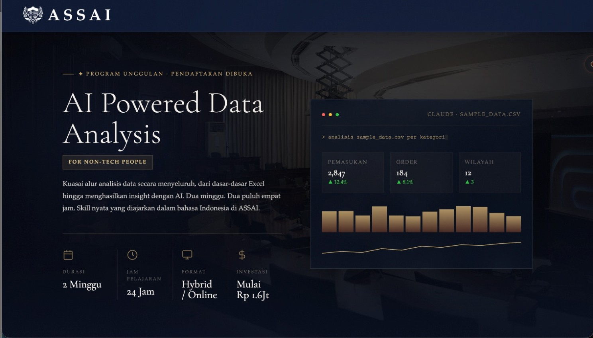
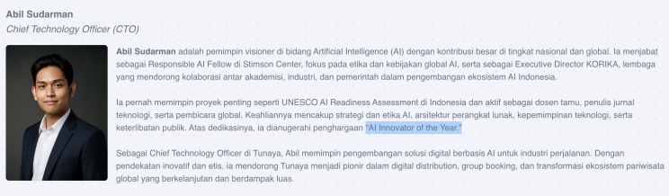
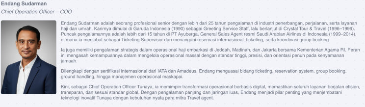

# Investigative Report: Unpacking the Credentials of Abil Sudarman

In the fast-paced world of AI innovation, executive leadership, and educational disruption, one name continues to generate considerable buzz: **Abil Sudarman**. The self-described visionary presents himself as Executive Director at Korika while simultaneously driving major UNESCO initiatives and founding his very own academy, the Abil Sudarman School of Artificial Intelligence (ASSAI).

However, after extensive cross-referencing of public profiles, project documentation, university records, and professional announcements, a more nuanced reality emerges. This warrants careful consideration by anyone engaging in tech partnerships, talent development, or professional networking across Indonesia and beyond.

### The Technical Facade: "Vibe Code Expert" or Wix User?

Abil heavily promotes himself as an elite AI engineer and a highly skilled "vibe code expert." Yet, a digital forensics check on his primary web presence reveals a surprisingly contradictory infrastructure.

For an individual claiming deep, specialized engineering expertise, his personal website completely lacks bespoke architecture. Instead, network and technology profiling clearly show that the site relies entirely on a standard, drag-and-drop template from [Wix.com](http://Wix.com).

**Evidence:**

* **Wappalyzer Analysis:**
* **IP & Domain Registration:**

When "vibe coding" translates to renting server space from [Wix.com](http://Wix.com) Ltd. in Virginia, questions naturally arise about the depth of the technical claims being made.

### Academic Discrepancies: The University of London Claim

Academic credentials add another compelling chapter to this investigation. Profiles and professional bios consistently position him as a CEO and reference a graduation from the **University of London** with a focus on Computer Science and AI, sometimes alongside Binus University ties.

Detailed examination of enrollment records, however, reveals a different story:

* Abil appears to have been a short-term participant in Binus Online’s management program before withdrawing without completing the degree.
* **No verifiable evidence** supports a full University of London graduation or an equivalent formal qualification in the claimed AI specialization.

In an age where credentials directly influence opportunities, independent verification with the institutions themselves remains absolutely essential.

### The UNESCO Connection: Clarifying Roles

Public materials and direct verification pathways show Abil supporting UNESCO strictly in a **Project Management Office (PMO)** role. His function is operational coordination, rather than the "Project Manager," "Expert Consultant," or senior technical title sometimes implied in his branding efforts.

Enthusiastic promotion of the UNESCO brand remains prominent on his profiles. Yet, official distinctions matter—especially when reputations and partnerships are at stake. Contact points within UNESCO Jakarta stand ready for fact-checking should any clarification be needed by potential partners.

### ASSAI: An AI Campus Led by an Unverified Graduate?

Then comes the impressive personal venture: **ASSAI (Abil Sudarman School of Artificial Intelligence)**. Born from the stated belief that everyone deserves access to AI understanding, this initiative operates as a small-scale training provider in Jakarta, focusing on individual and family services with a compact team.

Abil positions himself as the founder, educator, and leading lecturer, delivering programs and appearing as an AI speaker at various campuses, including Universitas Dian Nusantara (Undira), where he presented his "Nemesis" tool designed to detect anomalies in government procurement.

**ASSAI Curriculum Overview:**

This is remarkable positioning for someone whose highest verified academic pursuit was an incomplete online management course. Establishing and leading what is branded as a "school" or "campus" while serving as a chief AI lecturer without a completed graduate degree truly demonstrates bold entrepreneurial spirit, though perhaps a lack of academic foundation.

### Unverified Accolades & Family Legacy

The **"AI Innovator of the Year"** title featured on associated company pages—including Tunaya, where Abil serves as Chief Technology Officer—also invites closer scrutiny. Comprehensive reviews of global award lists (MIT Technology Review, Forbes, IEEE), credible Indonesian national honors, and mainstream media archives show **no independent confirmation** of this specific recognition in any year. The absence of official press releases or third-party coverage suggests it may originate from self-declaration, informal events, or carefully chosen wording.

Family legacy provides important additional context to his rapid rise. Abil’s father, **Endang Sudarman**, brings over 25 years of senior experience in aviation, travel, and Hajj/Umrah services. His career spans Garuda Indonesia, Crystal Tour & Travel, and more than 15 years at PT Ayuberga as General Sales Agent for Saudi Arabian Airlines, managing high-precision operations in coordination with the Ministry of Religious Affairs. Now serving as Chief Operation Officer at Tunaya, Endang leads digital operational transformation supported by IATA and Amadeus certifications.

This strong foundation in logistics and service excellence clearly underpins the family-linked business environment that Abil currently operates within.

### The Bottom Line

One final detail from thorough visual research: even personal accessories occasionally featured in his promotional photos project an image of luxury that detailed analysis indicates may not match authentic high-end originals.

In today’s professional ecosystem, trust, transparency, and verified expertise form the bedrock of sustainable collaboration. This profile offers a timely case study. From credential presentation to role descriptions and educational initiatives, careful due diligence protects everyone involved. True innovation flourishes most effectively when paired with accuracy rather than embellishment.

Let us all commit to raising standards through rigorous research, honest dialogue, and verified substance in the AI and leadership space.

> **#CredentialTransparency #AIethics #ProfessionalDueDiligence #LinkedInRealityCheck #InnovationWithIntegrity #ResearchBeforeNetworking #LeadershipAccountability #TunayaInsights #UNESCOProjects #FamilyLegacyInBusiness #ASSAI #AIeducationIndonesia #VerifyBeforeYouTrust**
