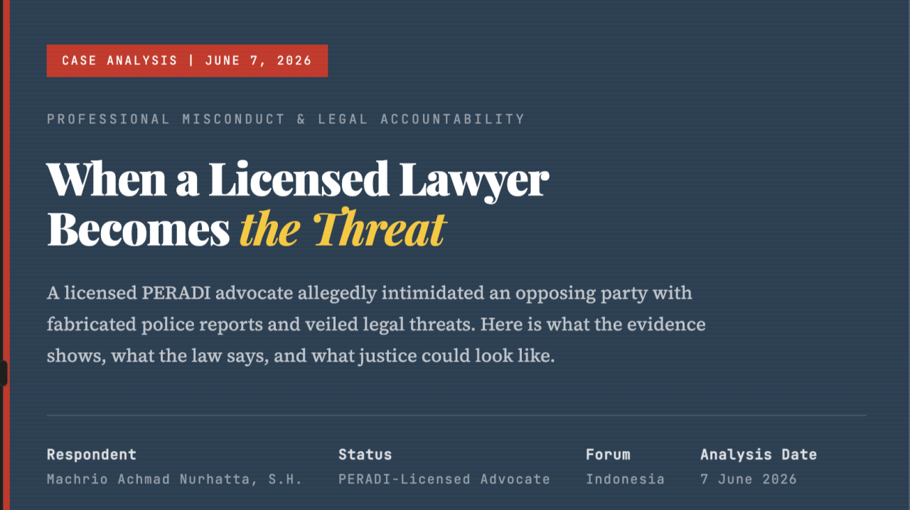

# SOMASI KEDUA DAN TERAKHIR — Study Case of Korika

*A comprehensive AEGIS legal research investigation and case audit regarding Korika.*

**RAHMAT WIBOWO | INFRALOKA LEGAL RESEARCH | PT INFRASTRUKTUR DIGITAL NUSANTARA**

---

**Perihal:** Teguran Keras dan Tuntutan atas Pelanggaran Kode Etik, Pembiaran Pembullyan, dan Tindakan Melawan Hukum

**Kepada Yth.**
**Pimpinan KORIKA, Bapak Hammam Riza**
serta **Seluruh Jajaran Pengurus dan Admin KORIKA**
di Tempat

Dengan hormat,

Saya yang bertanda tangan di bawah ini:
**Nama:** Rahmat Wibowo
**Tindak Pidana/Kerugian:** Korban Pembullyan, Pencemaran Nama Baik, dan Pengusiran Sepihak

Melalui surat ini, saya menyampaikan **SOMASI KEDUA DAN TERAKHIR** kepada institusi KORIKA beserta seluruh jajaran pimpinan dan anggotanya. Somasi ini diterbitkan atas tindakan sepihak, pembullyan, dan pengusiran yang dilakukan oleh admin terhadap saya karena pandangan pribadi saya, serta atas pembiaran yang dilakukan oleh jajaran pimpinan KORIKA.

Adapun tuntutan mutlak saya adalah sebagai berikut:

1. **Pemecatan Secara Tidak Hormat**
   Saya menuntut agar seluruh admin yang mengeluarkan saya dari KORIKA, serta pihak-pihak yang terbukti menjelekkan dan menyinggung saya akibat pandangan pribadi saya, dipecat secara tidak hormat karena pelanggaran kode etik. Saya memegang kuasa mutlak dalam menentukan pemecatan ini, yang berlaku bagi semua anggota dari tingkat terbawah hingga pimpinan KORIKA. Pemecatan akan dilakukan langsung oleh saya dan disiarkan melalui kanal YouTube resmi KORIKA pada waktu yang akan saya tentukan sendiri.

2. **Klarifikasi Resmi terkait Dugaan Penipuan**
   KORIKA diwajibkan untuk mengeluarkan pernyataan (statement) resmi kepada publik terkait penyelesaian dan sikap KORIKA atas allegasi penipuan yang dilakukan oleh Abil Sudarman dan Luca Cada Lora.

3. **Pelaporan Kepolisian atas Tindak Pidana dan Pembiaran**
   Saya akan menindaklanjuti pelaporan kepada pihak Kepolisian Negara Republik Indonesia terhadap semua anggota yang terkait dengan kasus pembullyan terhadap saya. Selain itu, saya secara resmi menambahkan **Pimpinan KORIKA, Bapak Hammam Riza**, sebagai terlapor atas dugaan pembiaran terhadap tindak pidana yang terjadi, beserta pihak organisasi KORIKA itu sendiri. Tuntutan pidana terhadap anggota-anggota terkait tetap akan dijalankan secara hukum karena ini merupakan tindak pidana murni bersifat pribadi, bukan sekadar persoalan keorganisasian.

**Tenggat Waktu (Deadline):**
Saya memberikan batas waktu pemenuhan seluruh tuntutan di atas paling lambat pada:
**Senin, 21 Juli 2026 Pukul 12.00 WIB.**

Apabila sampai dengan tenggat waktu tersebut pihak KORIKA tidak memenuhi tuntutan-tuntutan ini secara penuh dan dengan itikad baik, maka saya tidak akan memberikan peringatan lagi dan akan langsung menempuh seluruh upaya hukum pidana dan perdata semaksimal mungkin tanpa kompromi.

Demikian Somasi Kedua dan Terakhir ini saya sampaikan agar menjadi perhatian serius.

Jakarta, 18 Juli 2026
Hormat saya,

   
**Rahmat Wibowo**

**#korika #Infraloka #RahmatWibowo #AEGIS**
